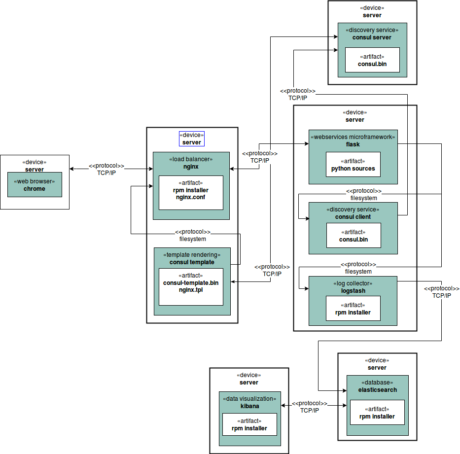
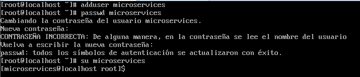

### Examen 3
**Universidad ICESI**  
**Curso:** Sistemas Operativos  
**Docente:** Daniel Barragán C.  
**Estudiante:** Jorge Eliecer Castaño Valencia.  
**Codigo:** A00315284  
**Tema:** Descubrimiento de servicios, Microservicios  
**Correo:** daniel.barragan at correo.icesi.edu.co

### Objetivos
* Implementar servicios web que puedan ser consumidos por usuarios o aplicaciones
* Conocer y emplear tecnologías de descubrimiento de servicio

### Prerrequisitos
* Virtualbox o WMWare
* Máquina virtual con sistema operativo CentOS7
* Framework consul, zookeper o etcd

### Descripción
El tercer parcial del curso sistemas operativos trata sobre la creación de servicios web y el uso de tecnologías para el descubrimiento de servicio

**Figura 1.** Despliegue básico de microservicios

### Actividades
1. Incluir nombre, código (5%)
2. Ortografía y redacción cuando sea necesario (5%)
3. Despliegue un esquema como el mostrado en la **figura 1**. Empleen un servicio web de su preferencia (puede usar alguno de los ejemplos de clase). No es necesario incluir los componentes para monitoreo (Elasticsearch, Kibana, Logstash) (30%)  

Para la realizacion de este ejercicio se emplearon tres maquinas vituales:  
- Lubuntu Yakkety: para el discovery service y el web browser. 
- Ubuntu Tau: para el load balancer y template rendering.
- CentOS7: para el flash microservice, discovery service y log colletor.

**En CentOS7:**
Lo primero que realize es la creacion del microservicio.  
Para esto, cree un usuario microservices:  
  

Luego de esto, descargue **virtualenv** para crear un ambiente virtual, ya que es por medio de los ambientes virtuales de python que es posible ejecutar múltiples proyectos con versiones de librerías distintas. Virtualenvwrapper es un wrapper para virtualenv el cual permite la activación de ambientes virtuales desde cualquier lugar del path del sistema operativo. 

Los comandos que fueron ejecutados (en modo root) fueron:  
# yum install -y wget  
# wget https://bootstrap.pypa.io/get-pip.py -P /tmp  
# python /tmp/get-pip.py  
# pip install virtualenv  

Y en microservices:  
# pip install --user virtualenvwrapper

Para iniciar virtualenvwrapper al autenticarse como el usuario microservices se edita el archivo **.bashrc** de la siguiente manera:  

$ vi ~/.bashrc
export WORKON_HOME=~/.virtualenvs
source /home/microservices/.local/bin/virtualenvwrapper.sh

Donde para activar los cambios sin necesidad de cerrar la sesión del usuario python_user se debe ejecutar el siguiente comando:

$ source ~/.bashrc

Luego de tener el ambiente virtual, se procede a crear el **microservice microframework**, para ello se instala Flash. Un micro web framework escrito en Python y basado en la especificación WSGI de Werkzeug y el motor de templates Jinja2. Y Tiene licencia BSD.
Para realizar esto se hizo lo siguiente:

* Crear un entorno el cual se llamara **flask_environment**  
$ mkvirtualenv flask_environment
$ workon flask_environment

4. Adicione un microservicio igual al ya desplegado. Muestre a través de evidencias como las peticiones realizadas al balanceador son dirigidas a la replica del microservicio (30%)
5. Describa los cambios o adiciones necesarias en el diagrama de la **figura 1** para adicionar un microservicio diferente al ya desplegado en el ambiente, tenga en cuenta los siguientes conceptos en su descripción: API Gateway, paradigma reactivo, load balancer, protocolo publicador/suscriptor (interconexión de microservicios) (20%)
6. El informe debe ser entregado en formato pdf a través del moodle y el informe en formato README.md debe ser subido a un repositorio de github. El repositorio de github debe ser un fork de https://github.com/ICESI-Training/so-exam3 y para la entrega deberá hacer un Pull Request (PR) respetando la estructura definida. El código fuente y la url de github deben incluirse en el informe (10%)  

### Referencias
https://github.com/ICESI/so-microservices-python  
http://microservices.io/patterns/microservices.html  
https://github.com/ICESI/so-microservices-python/tree/master/01_virtualenvs

